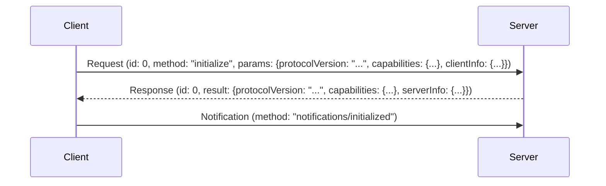

# Anthropic Model Context Protocol (MCP) TypeScript 客戶端開發規範 (詳細版)

## 1. 引言

### 1.1. 目的
本文檔旨在為使用 `@modelcontextprotocol/sdk` (TypeScript SDK) 開發 Anthropic Model Context Protocol (MCP) 客戶端的開發人員提供一套全面、詳細的指導方針和最佳實踐。遵循這些規範將有助於：
- 確保開發出的客戶端符合 MCP 協議標準。
- 利用 TypeScript 的類型系統提高代碼的健壯性和可維護性。
- 促進團隊成員之間的有效協作。
- 降低開發和調試過程中的複雜性。

### 1.2. 範圍
本規範涵蓋了從建立連接、管理會話、處理消息、使用傳輸層、類型系統、錯誤處理到最佳實踐的各個方面。

### 1.3. 目標讀者
本文檔適用於所有參與 MCP TypeScript 客戶端開發的工程師，無論其經驗水平如何。熟悉 TypeScript、`async`/`await` 和 JSON-RPC 概念將有助於理解本文檔。

## 2. MCP 核心概念詳解

### 2.1. MCP 客戶端角色與職責
MCP 客戶端在與伺服器的交互中扮演多重角色：

- **連接發起者 (Initiator)**: 客戶端負責通過選定的傳輸層（SSE, WebSocket, Stdio）建立與 MCP 伺服器的初始連接。
- **會話管理者 (Session Manager)**: 使用 `Client` 類（繼承自 `Protocol`）管理通信生命週期，包括初始化握手、維持連接狀態、處理超時等。
- **請求發送者 (Requester)**: 向伺服器發送請求（Request）以觸發操作或查詢信息。例如，請求執行一個工具 (`tools/call`) 或讀取一個資源 (`resources/read`)。客戶端需要處理伺服器的響應（Response），其中包含成功結果或錯誤信息。
- **通知發送者 (Notifier)**: 向伺服器發送通知（Notification），用於告知伺服器某個事件已發生，但不需要伺服器響應。例如，告知伺服器客戶端已完成初始化 (`notifications/initialized`) 或報告長時間運行的任務進度 (`notifications/progress`)。
- **請求響應者 (Responder)**: 伺服器也可能向客戶端發送請求。客戶端需要準備好接收這些請求，執行相應邏輯，並發送響應。例如，伺服器可能請求客戶端創建一個消息樣本 (`sampling/createMessage`) 或列出客戶端管理的根資源 (`roots/list`)。這通過在 `Protocol` 層註冊請求處理程序來實現。
- **通知接收者 (Receiver)**: 接收來自伺服器的通知，這些通知通常用於告知客戶端狀態變更或事件發生。例如，接收日誌消息 (`logging/message`) 或資源變更通知 (`resources/changed`)。這通過在 `Protocol` 層註冊通知處理程序來實現。

### 2.2. JSON-RPC 2.0 基礎
MCP 完全基於 JSON-RPC 2.0 協議。理解其核心組件至關重要：

- **消息結構**: 所有通信都封裝在 JSON 對象中。
    - **請求 (Request Object)**:
        - `jsonrpc`: 固定為 "2.0"。
        - `id`: 由客戶端生成的唯一標識符（字符串或數字），用於將響應與請求匹配。**必須提供**。
        - `method`: 一個字符串，指示要調用的方法名稱（例如 `"initialize"`, `"tools/call"`）。
        - `params`: 可選的結構化值（對象或數組），包含要傳遞給方法的參數。
    - **響應 (Response Object)**:
        - `jsonrpc`: 固定為 "2.0"。
        - `id`: 與對應請求的 `id` 相同。
        - `result`: 請求成功時**必須**包含此字段。其值由被調用方法定義。
        - `error`: 請求失敗時**必須**包含此字段。其值是一個包含 `code` (整數) 和 `message` (字符串) 的錯誤對象，可選地包含 `data`。`result` 和 `error` **不能**同時存在。
    - **通知 (Notification Object)**:
        - `jsonrpc`: 固定為 "2.0"。
        - `method`: 指示通知類型的方法名稱（例如 `"notifications/initialized"`）。
        - `params`: 可選的結構化值。
        - **注意**: 通知沒有 `id`，因為它們不需要響應。

- **`types.ts` 與 Zod 的作用**: `@modelcontextprotocol/sdk` 在 `types.ts` 模塊中使用 **Zod** 庫嚴格定義了所有 MCP 協議中規定的請求、響應、通知及其參數的 Schema。
    - **Schema 定義**: 每個消息類型和數據結構都有一個對應的 Zod Schema（例如 `InitializeRequestSchema`, `CallToolResultSchema`）。
    - **類型推斷**: SDK 使用 `z.infer<typeof SchemaName>` 從 Zod Schema 自動推斷出相應的 TypeScript 類型（例如 `InitializeRequest`, `CallToolResult`）。
    - **驗證**: Zod Schema 用於在運行時解析和驗證傳入和傳出的消息，確保它們符合協議規範。如果驗證失敗，會拋出 ZodError。
    - **強制使用**: **開發者應始終使用這些導出的 TypeScript 類型和 Zod Schema** 來確保類型安全和協議合規性。

### 2.3. 交互流程示例 (Initialize)


## 3. 會話管理 (`Client` 類) 深入解析

`Client` 類 (`src/client/index.ts`) 是與 MCP 伺服器交互的主要入口點，它建立在通用的 `Protocol` 類 (`src/shared/protocol.ts`) 之上。

### 3.1. 實例化與連接
```typescript
import { Client } from "@modelcontextprotocol/sdk/client";
import { WebSocketClientTransport } from "@modelcontextprotocol/sdk/client/websocket"; // 或 SseClientTransport, StdioClientTransport
import { Transport } from "@modelcontextprotocol/sdk/shared/transport";
import type { ServerNotification, ServerRequest } from "@modelcontextprotocol/sdk/types";

// 1. 實例化 Client
const client = new Client(
  { name: "MyAwesomeClient", version: "1.0.0" }, // 客戶端信息
  {
    // 可選的 ProtocolOptions
    // enforceStrictCapabilities: true, // 建議開啟以強制能力檢查
  }
);

// 2. (可選) 註冊客戶端能力
client.registerCapabilities({
  sampling: {}, // 表明支持 sampling/createMessage 請求
  roots: { listChanged: true }, // 支持 roots/list 請求和 list_changed 通知
});

// 3. (可選) 設置錯誤和關閉處理程序
client.onerror = (error) => {
  console.error("MCP Client Error:", error);
  // 可能需要處理重連或通知用戶
};
client.onclose = () => {
  console.log("MCP Connection Closed.");
  // 清理狀態或嘗試重連
};

// 4. (可選) 設置處理來自伺服器的請求和通知的處理程序 (見 3.4 和 3.5)
// client.setRequestHandler(...)
// client.setNotificationHandler(...)
// client.fallbackRequestHandler = async (request) => { ... };
// client.fallbackNotificationHandler = async (notification) => { ... };

async function connectAndUseClient() {
  // 5. 選擇並實例化傳輸層
  const transport: Transport = new WebSocketClientTransport(new URL("ws://localhost:8000/mcp"));
  // const transport: Transport = new SseClientTransport(new URL("http://localhost:8000/mcp"), { authProvider });
  // const transport: Transport = new StdioClientTransport({ command: "node", args: ["server.js"] });

  try {
    // 6. 連接傳輸層並自動執行初始化握手
    await client.connect(transport);
    console.log("MCP Client Connected and Initialized!");
    console.log("Server Info:", client.getServerVersion());
    console.log("Server Capabilities:", client.getServerCapabilities());
    console.log("Server Instructions:", client.getInstructions()); // 可能為 undefined

    // 7. 在此處執行其他 MCP 操作...
    await listAvailableTools(client);

  } catch (error) {
    console.error("Failed to connect or initialize:", error);
  } finally {
    // 8. (可選) 在適當時機關閉連接
    // await client.close();
  }
}

async function listAvailableTools(client: Client) {
  try {
    const result = await client.listTools();
    console.log("Available tools:");
    result.tools.forEach(tool => console.log(`- ${tool.name}: ${tool.description}`));
  } catch (error) {
    console.error("Error listing tools:", error);
  }
}

// connectAndUseClient();
```
- **構造函數**: 接收客戶端實現信息 (`Implementation`) 和可選的 `ClientOptions`。
- **`registerCapabilities()`**: 在 `connect()` 之前調用，用於聲明客戶端支持的能力。
- **`connect(transport: Transport)`**: 核心方法。
    - 將 `Client` 實例附加到底層的 `Transport` 實例。
    - 自動調用 `transport.start()`。
    - **自動執行初始化**: 發送 `initialize` 請求，處理響應，檢查協議版本兼容性，存儲伺服器能力 (`_serverCapabilities`) 和信息 (`_serverVersion`, `_instructions`)。
    - 發送 `notifications/initialized` 通知。
    - 如果初始化失敗，會自動關閉連接並拋出錯誤。
- **`close()`**: 關閉底層傳輸連接。

### 3.2. 發送請求與處理響應 (常用方法示例)

`Client` 類提供了與 MCP 標準方法對應的便捷 `async` 方法，這些方法內部調用 `Protocol` 基類的 `request()` 方法。

- **`initialize()`**: 通常不需要手動調用，`connect()` 會自動處理。
- **`ping(options?: RequestOptions)`**: 發送 `ping` 請求。返回一個解析為 `EmptyResult` 的 Promise。
  ```typescript
  await client.ping();
  console.log("Ping successful!");
  ```
- **`listTools(params?: ListToolsRequest["params"], options?: RequestOptions)`**: 獲取伺服器工具列表。返回解析為 `ListToolsResult` 的 Promise。
  ```typescript
  // (示例見 3.1)
  ```
- **`callTool(params: CallToolRequest["params"], resultSchema?, options?: RequestOptions)`**: 調用伺服器工具。返回解析為 `CallToolResult` (或兼容模式下的舊格式) 的 Promise。
  ```typescript
  try {
    const toolResult = await client.callTool(
      { name: "get_weather", arguments: { city: "Taipei", unit: "metric" } },
      undefined, // 使用默認的 CallToolResultSchema
      { timeout: 10000 } // 設置 10 秒超時
    );
    console.log("Tool call result:");
    toolResult.content.forEach(content => {
      if (content.type === "text") {
        console.log(content.text);
      }
    });
  } catch (error) {
    if (error instanceof McpError) {
      console.error(`Tool call failed: ${error.code} - ${error.message}`, error.data);
    } else {
      console.error("Unexpected error calling tool:", error);
    }
  }
  ```
- **其他請求方法**: `listResources`, `listResourceTemplates`, `readResource`, `subscribeResource`, `unsubscribeResource`, `listPrompts`, `getPrompt`, `complete`, `setLoggingLevel` 等，用法類似。它們都返回一個 Promise，解析為對應的 Result 類型 (由 Zod Schema 定義)。

**`RequestOptions`**:
所有請求方法都可以接受一個可選的 `options` 對象，用於控制單次請求的行為：
- `onprogress?: ProgressCallback`: 設置處理進度通知的回調。客戶端會自動在請求中添加 `_meta.progressToken`。
- `signal?: AbortSignal`: 傳遞 `AbortSignal` 以便能夠取消請求。如果取消，`request()` 返回的 Promise 會被拒絕 (reject) 並帶有 `AbortError` 或信號的 `reason`。客戶端會自動向伺服器發送 `notifications/cancelled`。
- `timeout?: number`: 本次請求的超時時間（毫秒），默認為 `DEFAULT_REQUEST_TIMEOUT_MSEC` (60000)。超時會導致 Promise 被拒絕並帶有 `McpError` (code: `RequestTimeout`)。
- `resetTimeoutOnProgress?: boolean`: 如果為 `true`，收到進度通知會重置超時計時器。默認為 `false`。
- `maxTotalTimeout?: number`: 最大總超時時間（毫秒）。即使有進度通知，超過此時間也會超時。

### 3.3. 發送通知

- **`notification(notification: ClientNotification | NotificationT)`**: 發送通知。內部調用 `Protocol` 基類的 `notification()` 方法。
  ```typescript
  // 發送進度通知 (需要先獲取 progressToken，通常是請求時的 messageId)
  // 注意：Protocol 基類會自動處理發送請求時 onprogress 回調觸發的進度通知，
  // 手動發送 progress 通知通常用於客戶端自身發起的長時間操作。
  // await client.notification({
  //   method: "notifications/progress",
  //   params: { progressToken: "some-token", progress: 0.5, total: 1.0 }
  // });

  // 如果客戶端管理根資源，通知伺服器列表變更
  await client.sendRootsListChanged();
  ```
- **`sendRootsListChanged()`**: `Client` 類提供的便捷方法，用於發送 `notifications/roots/list_changed` 通知。

### 3.4. 處理伺服器請求 (`setRequestHandler`)

當伺服器向客戶端發送請求時（例如 `sampling/createMessage`, `roots/list`, `ping`），需要有對應的處理程序來響應。這通過 `Protocol` 基類提供的 `setRequestHandler` 方法實現。

```typescript
import { Client } from "@modelcontextprotocol/sdk/client";
import { CreateMessageRequestSchema, ListRootsRequestSchema, PingRequestSchema, ErrorCode } from "@modelcontextprotocol/sdk/types";
import type { RequestHandlerExtra, ClientResult } from "@modelcontextprotocol/sdk"; // 導入 RequestHandlerExtra

// ... 實例化 client ...

// 處理 sampling/createMessage 請求
client.setRequestHandler(CreateMessageRequestSchema, async (request, extra): Promise<ClientResult> => {
  console.log(`Received sampling request (ID: ${request.id}): ${request.params.messages[0]?.content}`);
  extra.signal.throwIfAborted(); // 檢查請求是否已被取消

  // 模擬異步處理
  await new Promise(resolve => setTimeout(resolve, 100));

  // 檢查是否在處理過程中被取消
  if (extra.signal.aborted) {
    console.log(`Sampling request ${request.id} was cancelled during processing.`);
    // 雖然請求已被取消，但仍需返回一個結果或錯誤以完成響應流程，
    // 但這個響應可能不會被發送或被對端忽略。
    // 返回一個錯誤可能是合適的。
    return { code: ErrorCode.InternalError, message: "Processing aborted" };
  }

  // 假設生成了消息
  return {
    model: "client-model-v1",
    role: "assistant",
    content: { type: "text", text: "Generated response by client." },
  };
});

// 處理 roots/list 請求
client.setRequestHandler(ListRootsRequestSchema, async (request, extra): Promise<ClientResult> => {
  console.log(`Received list roots request (ID: ${request.id})`);
  extra.signal.throwIfAborted();
  // 假設客戶端管理一些根目錄
  const roots = [
    { uri: "file:///Users/me/project1", name: "Project 1" },
    { uri: "file:///Users/me/docs", name: "Documents" },
  ];
  return { roots };
});

// Ping 請求默認由 Protocol 基類處理 (自動回 Pong)，但也可以覆蓋
// client.setRequestHandler(PingRequestSchema, async (request, extra) => {
//   console.log("Received Ping, sending Pong.");
//   return {}; // EmptyResult
// });

// 設置回退處理程序，處理未被上面特定處理程序捕獲的請求
client.fallbackRequestHandler = async (request): Promise<ClientResult> => {
  console.warn(`Received unhandled request: ${request.method}`);
  // 必須返回一個錯誤結果
  return {
    code: ErrorCode.MethodNotFound,
    message: `Method '${request.method}' not handled by this client.`,
  };
};
```
- **`setRequestHandler(requestSchema, handler)`**:
    - `requestSchema`: 來自 `types.ts` 的 Zod Schema，用於標識請求方法並驗證傳入的請求對象。
    - `handler`: 一個 `async` 函數，接收兩個參數：
        - `request`: 經過 Zod 驗證的請求對象 (類型由 `requestSchema` 推斷)。
        - `extra: RequestHandlerExtra`: 包含 `signal` (一個 `AbortSignal`，用於檢查請求是否已被發送方取消) 和 `sessionId` (如果傳輸層提供)。
    - `handler` **必須** 返回一個 Promise，該 Promise 解析為相應的 `ClientResult` 類型（或在出錯時解析為包含 `code` 和 `message` 的錯誤對象，或者直接拋出錯誤）。
- **`fallbackRequestHandler`**: 如果設置了，當收到一個沒有通過 `setRequestHandler` 註冊特定處理程序的請求時，會調用此函數。它接收未經驗證的原始 `Request` 對象，**必須** 返回一個表示錯誤的 `ClientResult`。
- **能力檢查**: `setRequestHandler` 會調用 `assertRequestHandlerCapability` (由 `Client` 類實現) 來檢查客戶端是否聲明了處理該請求所需的能力。

### 3.5. 處理伺服器通知 (`setNotificationHandler`)

伺服器發送通知告知客戶端事件，無需響應。使用 `Protocol` 基類的 `setNotificationHandler` 方法註冊處理程序。

```typescript
import { Client } from "@modelcontextprotocol/sdk/client";
import { LoggingMessageNotificationSchema, ResourceUpdatedNotificationSchema } from "@modelcontextprotocol/sdk/types";

// ... 實例化 client ...

// 處理 logging/message 通知
client.setNotificationHandler(LoggingMessageNotificationSchema, async (notification) => {
  console.log(`[Server Log - ${notification.params.level}]: ${notification.params.data}`);
});

// 處理 resources/updated 通知
client.setNotificationHandler(ResourceUpdatedNotificationSchema, async (notification) => {
  console.log(`Resource updated: ${notification.params.uri}`);
  // 觸發重新讀取資源的邏輯
  // await client.readResource({ uri: notification.params.uri });
});

// 設置回退處理程序，處理未被特定處理程序捕獲的通知
client.fallbackNotificationHandler = async (notification) => {
  console.warn(`Received unhandled notification: ${notification.method}`);
};
```
- **`setNotificationHandler(notificationSchema, handler)`**:
    - `notificationSchema`: 來自 `types.ts` 的 Zod Schema，用於標識通知方法並驗證傳入的通知對象。
    - `handler`: 一個 `async` 函數，接收經過 Zod 驗證的通知對象 (類型由 `notificationSchema` 推斷)。它**不應**返回任何值。
- **`fallbackNotificationHandler`**: 如果設置了，當收到一個沒有特定處理程序的通知時，會調用此函數。它接收未經驗證的原始 `Notification` 對象。
- **內建處理程序**: `Protocol` 基類會自動處理 `notifications/cancelled` (觸發對應請求的 `AbortSignal`) 和 `notifications/progress` (調用請求時提供的 `onprogress` 回調)。

## 4. 傳輸層 (`Transport`) 詳解

傳輸層負責在客戶端和伺服器之間實際傳遞序列化後的 JSON-RPC 消息。`Client` 類通過 `Transport` 接口與具體的傳輸實現解耦。

### 4.1. `Transport` 接口
所有傳輸層都實現了 `Transport` 接口 (`src/shared/transport.ts`)，該接口定義了基本的回調屬性和方法：
- **回調**: `onclose?`, `onerror?`, `onmessage?`
- **方法**:
    - `start(): Promise<void>`: 建立連接。
    - `close(): Promise<void>`: 關閉連接。
    - `send(message: JSONRPCMessage): Promise<void>`: 發送消息。
- **`sessionId?`**: 可選的會話標識符。

### 4.2. SSE (`SSEClientTransport`)
- **機制**: 使用 HTTP Server-Sent Events (EventSource) 接收消息，使用 Fetch API 發送 POST 請求。
- **適用場景**: Web 瀏覽器環境，需要跨域或通過防火牆連接。
- **配置 (`SSEClientTransportOptions`)**:
    - `authProvider?: OAuthClientProvider`: 用於處理 OAuth2 認證流程 (詳見 4.5)。
    - `eventSourceInit?: EventSourceInit`: 自定義 `EventSource` 的初始化選項 (注意: 可能覆蓋自動的 `Authorization` 頭)。
    - `requestInit?: RequestInit`: 自定義發送消息時 `fetch` POST 請求的選項。
- **使用**:
  ```typescript
  import { SseClientTransport } from "@modelcontextprotocol/sdk/client/sse";
  const transport = new SseClientTransport(new URL("https://example.com/mcp"));
  // await client.connect(transport);
  ```

### 4.3. WebSocket (`WebSocketClientTransport`)
- **機制**: 使用標準 WebSocket API (`mcp` 子協議)。
- **適用場景**: 需要低延遲、雙向通信的環境（瀏覽器和 Node.js）。
- **配置**: 只需提供 WebSocket 服務的 URL。
- **使用**:
  ```typescript
  import { WebSocketClientTransport } from "@modelcontextprotocol/sdk/client/websocket";
  const transport = new WebSocketClientTransport(new URL("wss://example.com/mcp"));
  // await client.connect(transport);
  ```

### 4.4. Stdio (`StdioClientTransport`) - Node.js Only
- **機制**: 啟動本地子進程，通過 stdin/stdout 進行通信。使用換行符分隔的 JSON 消息。
- **適用場景**: Node.js 環境中與本地腳本或可執行文件形式的 MCP 伺服器交互。
- **配置 (`StdioServerParameters`)**:
    - `command`: 可執行文件路徑或命令。
    - `args?`: 命令行參數數組。
    - `env?`: 子進程環境變數 (默認繼承部分安全變數)。
    - `stderr?`: stderr 處理方式 (`'inherit'`, `'pipe'`, `'ignore'`, Stream, number)。
    - `cwd?`: 子進程工作目錄。
- **使用**:
  ```typescript
  import { StdioClientTransport, getDefaultEnvironment } from "@modelcontextprotocol/sdk/client/stdio";
  const transport = new StdioClientTransport({
    command: "node",
    args: ["./my-mcp-server.js"],
    // env: { ...getDefaultEnvironment(), MY_VAR: "value" },
    // stderr: 'pipe' // 如果需要捕獲 stderr
  });
  // await client.connect(transport);
  // if (transport.stderr) { transport.stderr.pipe(process.stderr); } // 如果 stderr 是 'pipe'
  ```
- **注意**: 依賴 Node.js 的 `child_process` API。`serializeMessage` 和 `ReadBuffer` (`shared/stdio.ts`) 用於處理消息幀。

### 4.5. SSE 認證流程 (`client/auth.ts`)
- `SSEClientTransport` 可以集成 OAuth2 授權碼流程 (PKCE)。
- 需要提供一個實現 `OAuthClientProvider` 接口的對象，該接口定義了獲取/存儲 Token、獲取授權 URL、交換 Code 等方法。
- **流程**:
    1.  `connect()` 時，`SSEClientTransport` 調用 `auth(authProvider, { serverUrl })`。
    2.  `auth` 檢查現有 Token。如果有效，連接繼續。
    3.  如果 Token 過期或不存在，`auth` 嘗試使用 Refresh Token (如果可用) 刷新。
    4.  如果刷新失敗或無 Token，`auth` 調用 `authProvider.redirectToAuthorization()` 獲取授權 URL，並拋出 `UnauthorizedError`。
    5.  客戶端應用程序捕獲 `UnauthorizedError`，將用戶重定向到授權 URL。
    6.  用戶授權後，被重定向回客戶端應用程序，URL 中帶有 `code` 參數。
    7.  客戶端應用程序調用 `transport.finishAuth(code)`。
    8.  `finishAuth` 內部再次調用 `auth(authProvider, { serverUrl, authorizationCode })`，使用 `code` 交換 Access Token 和 Refresh Token，並存儲它們。
    9.  客戶端應用程序可以再次嘗試 `client.connect(transport)`。
- **Token 過期**: 在 `send()` 消息時如果遇到 401 錯誤，`SSEClientTransport` 會自動嘗試刷新 Token 並重試發送。如果刷新失敗，會拋出 `UnauthorizedError`，需要重新執行完整的授權流程。

## 5. 類型系統 (`types.ts` 與 Zod)

- **核心**: `types.ts` 使用 Zod 定義了所有 MCP 消息和數據結構的 Schema。
- **優勢**:
    - **類型安全**: 通過 `z.infer` 自動生成 TypeScript 類型，確保編譯時類型檢查。
    - **運行時驗證**: `Schema.parse()` 方法在解析傳入數據（例如來自網絡的 JSON）時提供嚴格的運行時驗證，捕獲不符合協議的數據。
    - **單一事實來源**: Schema 同時定義了數據結構和驗證規則。
- **使用**:
    - **導入類型**: `import type { InitializeResult, CallToolRequest } from "@modelcontextprotocol/sdk/types";`
    - **導入 Schema**: `import { InitializeResultSchema, CallToolRequestSchema } from "@modelcontextprotocol/sdk/types";`
    - **驗證輸入**: 在處理來自不可信來源的數據時使用 `Schema.parse()`。`Protocol` 類內部會自動使用 Schema 驗證傳入的消息。
    - **構造數據**: 直接創建符合 TypeScript 類型的對象。

## 6. 異步編程 (Promises, `async`/`await`, `AbortSignal`)

- **基於 Promise**: TypeScript SDK 大量使用 Promise 處理異步操作（網絡請求、進程通信、超時）。
- **`async`/`await`**: 是使用 SDK 的標準方式，簡化了 Promise 的鏈式調用和錯誤處理。
- **`AbortSignal`**: 用於取消異步操作，特別是長時間運行的請求。
    - 創建 `AbortController`: `const controller = new AbortController();`
    - 傳遞 `signal`: `await client.callTool(..., { signal: controller.signal });`
    - 取消操作: `controller.abort();` 或 `controller.abort(new Error("Reason"));`
    - 在請求處理程序中檢查: `extra.signal.throwIfAborted();` 或檢查 `extra.signal.aborted` 屬性。

## 7. 全面的錯誤處理策略

- **`McpError`**: SDK 定義了 `McpError` 類 (`src/types.ts`)，用於表示協議層面的錯誤（對應 JSON-RPC 的 `error` 對象）。它包含 `code` (來自 `ErrorCode` 枚舉)、`message` 和可選的 `data`。
- **傳輸層錯誤**:
    - **類型**: 網絡錯誤 (Fetch API 錯誤, WebSocket 錯誤), 連接錯誤, `EventSource` 錯誤, 子進程錯誤 (Stdio)。
    - **處理**: 通常由 `Transport` 實現捕獲並通過 `onerror` 回調報告給 `Protocol` 層。`Protocol` 層再通過自己的 `onerror` 回調暴露給應用程序。連接建立失敗通常直接在 `start()` 或 `connect()` 時拋出。
    - **策略**: 在 `client.onerror` 中處理，記錄錯誤，可能觸發重連機制。
- **協議/會話錯誤**:
    - **類型**:
        - **JSON 解析/Zod 驗證錯誤**: 傳入的消息格式無效或不符合 Schema (`SyntaxError`, `ZodError`)。通常由 `Transport` 或 `Protocol` 捕獲並通過 `onerror` 報告。
        - **伺服器返回錯誤**: `client.request()` 返回的 Promise 會被拒絕 (reject) 並帶有 `McpError`。
        - **請求超時**: `client.request()` 返回的 Promise 會被拒絕並帶有 `McpError` (code: `RequestTimeout`)。
        - **請求被取消**: `client.request()` 返回的 Promise 會被拒絕並帶有 `AbortError` 或 `AbortSignal` 的 `reason`。
        - **初始化失敗**: `client.connect()` 拋出錯誤 (可能是 `McpError` 或其他錯誤)。
    - **策略**:
        - 使用 `try...catch` 捕獲 `client.request()` 或 `client.connect()` 可能拋出的錯誤。
        - 檢查錯誤類型 (`instanceof McpError`, `instanceof AbortError` 等)。
        - 對於 `McpError`，檢查 `error.code` 以確定具體錯誤類型。
        - 實現重試、用戶通知等邏輯。

- **應用程序邏輯錯誤**:
    - **類型**: 在請求/通知處理程序或應用程序其他部分中的錯誤。
    - **處理**: 使用標準的 `try...catch`。確保處理程序中的未捕獲錯誤不會導致客戶端崩潰（`Protocol` 基類會嘗試捕獲處理程序中的錯誤並通過 `onerror` 報告）。
    - **策略**: 編寫健壯的處理程序，進行輸入驗證，添加日誌記錄。

```typescript
// 示例：處理請求錯誤
try {
  const result = await client.callTool({ name: "risky_tool" }, undefined, { timeout: 5000 });
  // 處理成功結果
} catch (error) {
  if (error instanceof McpError) {
    console.error(`MCP Error (${error.code}): ${error.message}`, error.data);
    if (error.code === ErrorCode.RequestTimeout) {
      // 處理超時
    } else if (error.code === ErrorCode.InvalidParams) {
      // 處理無效參數
    }
  } else if (error instanceof DOMException && error.name === 'AbortError') {
     console.log("Request was cancelled:", error.message);
  } else {
    console.error("Unexpected error:", error);
  }
}
```

## 8. 開發最佳實踐與建議

- **清晰分層**: 保持應用邏輯、`Client` 會話管理和 `Transport` 傳輸層的職責分離。
- **資源管理**: 雖然 TypeScript/JavaScript 沒有像 Python `with` 那樣的顯式上下文管理器，但要確保在不再需要客戶端時調用 `client.close()` 來關閉底層連接和釋放資源（特別是 Stdio 的子進程）。
- **配置外部化**: 使用環境變數、配置文件或啟動參數管理 URL、命令、認證信息等。
- **健壯的處理程序**:
    - 請求和通知處理程序應設計為健壯的，並處理潛在的錯誤。
    - 避免在處理程序中執行長時間阻塞的操作；如果需要，使用異步操作或將任務委派給 Web Workers (瀏覽器) 或 worker_threads (Node.js)。
    - 在請求處理程序中，始終檢查 `extra.signal.aborted` 以支持取消。
- **日誌記錄**: 使用 `console.log`, `console.error` 或更成熟的日誌庫（如 `pino`, `winston`）記錄關鍵事件和錯誤。
- **依賴管理**: 使用 `npm`, `yarn`, 或 `pnpm` 管理項目依賴。
- **測試**:
    - **單元測試**: 使用 `vitest`, `jest` 等框架測試獨立組件和處理程序。可以使用 `vi.mock` 或 `jest.mock` 來模擬 `Client` 或 `Transport`。
    - **集成測試**: 測試客戶端與真實或模擬 MCP 伺服器的完整交互。
    - **傳輸層測試**: 確保所選傳輸層在目標環境（瀏覽器、Node.js）按預期工作。
- **文檔**: 為客戶端代碼編寫 JSDoc 或 TSDoc 註釋。
